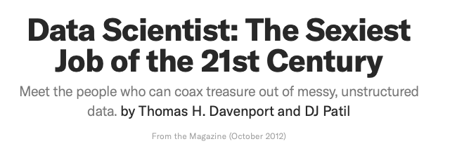
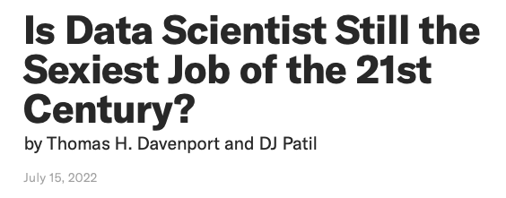
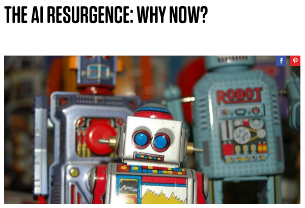
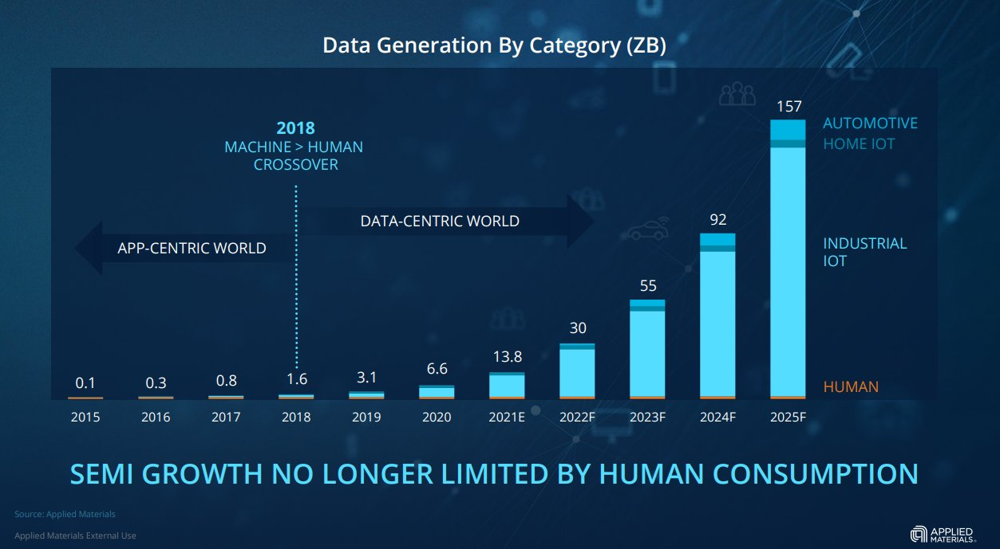
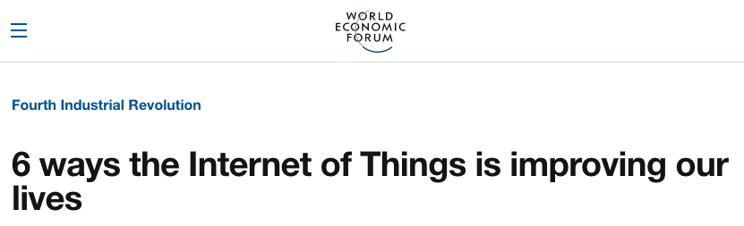
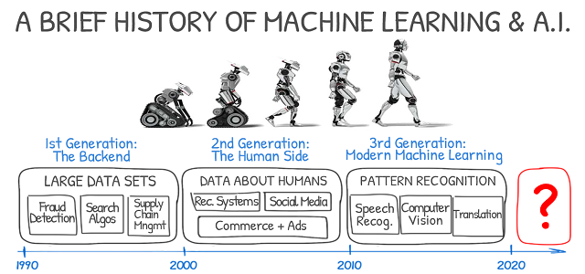
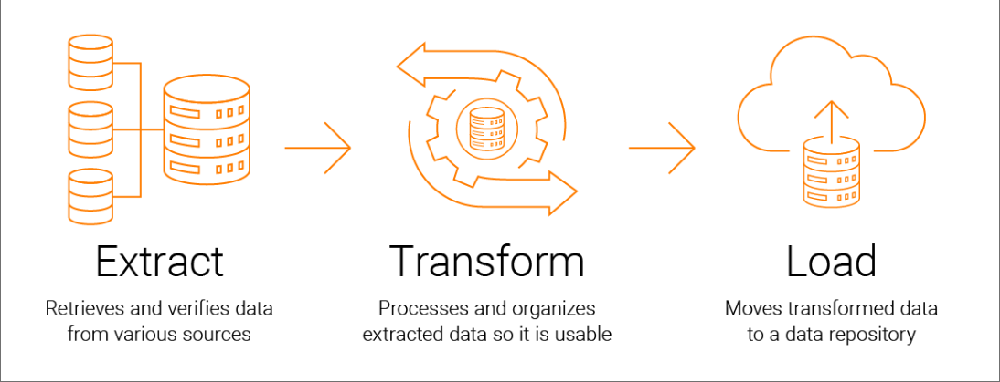

# Introduction to Data Analytics :rocket:

Kyunghee Lee

---

# Meet Your Instructor

- Assistant Professor of Information Systems
- PhD in Management Engineering, KAIST
- Wayne State University (2017-2023); **McGill University (2016-2017)**
- Research interests: Data analytics, AI, and digital transformation

---

# Taxi vs. Uber

add the maps from the access project.

---

#### https://hbr.org/2012/10/data-scientist-the-sexiest-job-of-the-21st-century https://hbr.org/2022/07/is-data-scientist-still-the-sexiest-job-of-the-21st-century

---

<!-- the infrastructure and classification approaches has been **scaled**, enabling the tackling of ambitious problems on **larger data-sets**. -->

#### https://www.wired.com/insights/2015/03/ai-resurgence-now/

---

# Data is the new oil

#### https://ana.blogs.com/maestros/2006/11/data_is_the_new.html

---

---

> Along with advanced data analytics, IoT-enabled devices and sensors are helping us reduce air pollution in some of our world’s biggest cities, improve agriculture and our food supply, and even detect and contain deadly viruses

#### https://www.weforum.org/agenda/2018/01/6-ways-the-internet-of-things-is-improving-our-lives/

---

#### https://medium.com/@ODSC/the-history-and-future-of-ai-with-michael-i-jordan-85f9962ff139

---

## **Target**ed Ad

- Target estimated "pregnancy score" based on purchase pattern
- And, sent coupons according to the stage of pregnancy

#### https://www.forbes.com/sites/kashmirhill/2012/02/16/how-target-figured-out-a-teen-girl-was-pregnant-before-her-father-did/#6298ff1e6668

---

## AI recruiter

https://www.youtube.com/embed/8QEK7B9GUhM

#### https://www.economist.com/business/2013/04/06/robot-recruiters

---

# ChatGPT

---

# Course objective

> Analytics is the scientific process of transforming data into insights for the purpose of making better decisions.

 

* Understand and apply fundamental programming concepts in Python.
* Utilize Python libraries to read, manipulate, and visualize data.
* Perform basic data cleaning, wrangling, and analysis tasks.
* Use SQL for managing data in relational databases.
* Implement an end-to-end Extract-Transform-Load (ETL) workflow.
* Apply these skills in a final project, demonstrating their ability to work with real-world data.

#### https://www.informs.org/About-INFORMS/News-Room/O.R.-and-Analytics-in-the-News/Best-definition-of-analytics

---

# Toolkit

- Scratch
- Python
- Google Colab
- SQL (SQLite)
- DataCamp
- Lockdown Browser

**This course is heavy on hands-on exercises. You must have access to a laptop/desktop.**

---

# Course format

- Lecture / Lab
- Exercise
- Quiz
- Homework
- Midterm exam
- Final project

---

# Exercise (20%)

- Interactive Python coding exercises from DataCamp
- Multiple attempts
- Pass/Fail
- 10 exercises in total.

---

# Quizzes (20%)

- In-class
- You will have access to your coding environment to answer questions

---

# Homework (20%)

- HW1: Scratch
- HW2: API
- HW3: Data visualization
- HW4: SQL

---

# Exam (20%)

- Midterm exam
- Similar to the quiz format

---

# Final project (20%)

- End-to-end ETL workflow
- To solve a real-world problem with real-world data
- Group project (3-4 students)
- 3 deliverables: proposal, presentation, and report (**Colab notebook**)

---

# Grading policy

* Late submission: 10% deduction/day; won't be accepted after 10 days
* Deferring exam: Only for extraordinary situations; documentation required
* **Zero tolerance** for plagiarism

---

# Module 1 - Fundamentals of programming

---

# Module 2 - Fundamentals of data analytics

- **Data cleaning & wrangling: Import ➡️ Tidy ➡️ Transform**
- **Data exploration: Transform ➡️ Visualize**
- Modeling: Model (INSY442, INSY446)

---

# Module 3 - Extract-Transform-Load (ETL)

---

# Wrap up

- Check out the instructions to set up your computer
- Questions?
    - Office hour: 2:30-3:30pm, Thursday
    - TA: <email>
    