# Fundamentals of programming

---

# Fundamentals of programming

- Representation
- Control
- Abstraction

---

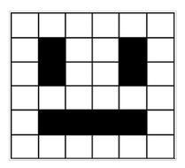

---

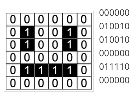

---

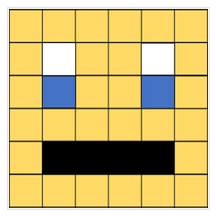

---

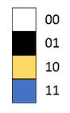

---

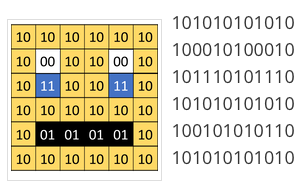

---

# Representation

<!-- This is how computers understand real-world objects. A series of preset binary sequences that represents something in the real world and can be rendered back to its original form so human can understand. -->

- Number
- Text
- Image
- Sound
- Video
- ...

#### https://www.teachwithict.com/binary-representation-of-images.html

---

```
Start of Semester
        |
        v
+------------------+
| Everyday Routine |
+------------------+
        |
        v
Should I go to class today?
    |
    +-- Is it Monday again?
    |      |
    |      +-- Yes:
    |      |      |
    |      |      +-- Is coffee available?
    |      |            |
    |      |            +-- Yes: Continue to next decision
    |      |            |
    |      |            +-- No: Go back to bed (repeat routine tomorrow)
    |      |
    |      +-- No: Continue to next decision
    |
    |     ...
    |
        |
        v
Repeat Everyday Routine (Go back to "Should I go to class today?")

```

---

```
Should I go to class today?
    |
    +-- Did I do the homework?
    |      |
    |      +-- Yes:
    |      |      |
    |      |      +-- Is there free food on campus today?
    |      |            |
    |      |            +-- Yes: Go to class (and grab food)
    |      |            |
    |      |            +-- No:
    |      |                  |
    |      |                  +-- Have I already skipped too many times?
    |      |                        |
    |      |                        +-- Yes: Go to class (sigh)
    |      |                        |
    |      |                        +-- No: Play video games at home
    |      |
    |      +-- No:
    |            |
    |            +-- Will the professor notice if I'm not there?
    |                  |
    |                  +-- Yes: Go to class (and pretend to understand)
    |                  |
    |                  +-- No:
    |                        |
    |                        +-- Is my favorite show releasing a new episode today?
    |                              |
    |                              +-- Yes: Stay home and watch
    |                              |
    |                              +-- No: Go to class (while feeling guilty)
    |
```

---


# Control

<!-- How decisions are made or rules are carried out. It sequentially proceeds, branches out upon certain conditions, and repeat. This is what makes what we call function or algorithm. A set of rules on how actions should be performed. -->

- Sequence
- Selection
- Iteration
- ...

---


---

# Abstraction

<!-- We don't need to know how car engines work in order to drive. -->

- Function
- Class
- Module
- Package
- Library
- Framework
- ...

---

<!-- We enter some input, a form of representation of real world objects, into a box that carries out certain rules, and get the output of the box, again in a form of representation. This is the most basic and fundamental unit of computer programs. -->

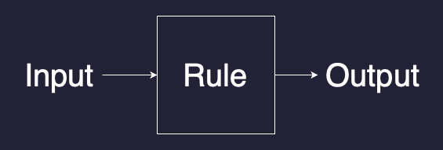

---

<!-- See how we implement this in Scratch. What's Scratch? -->

# Scratch

---

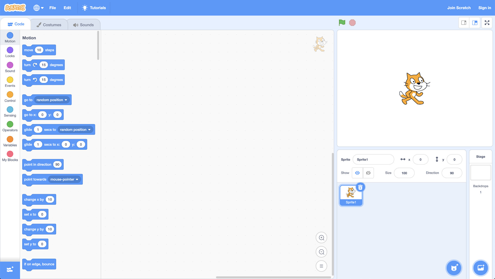

---

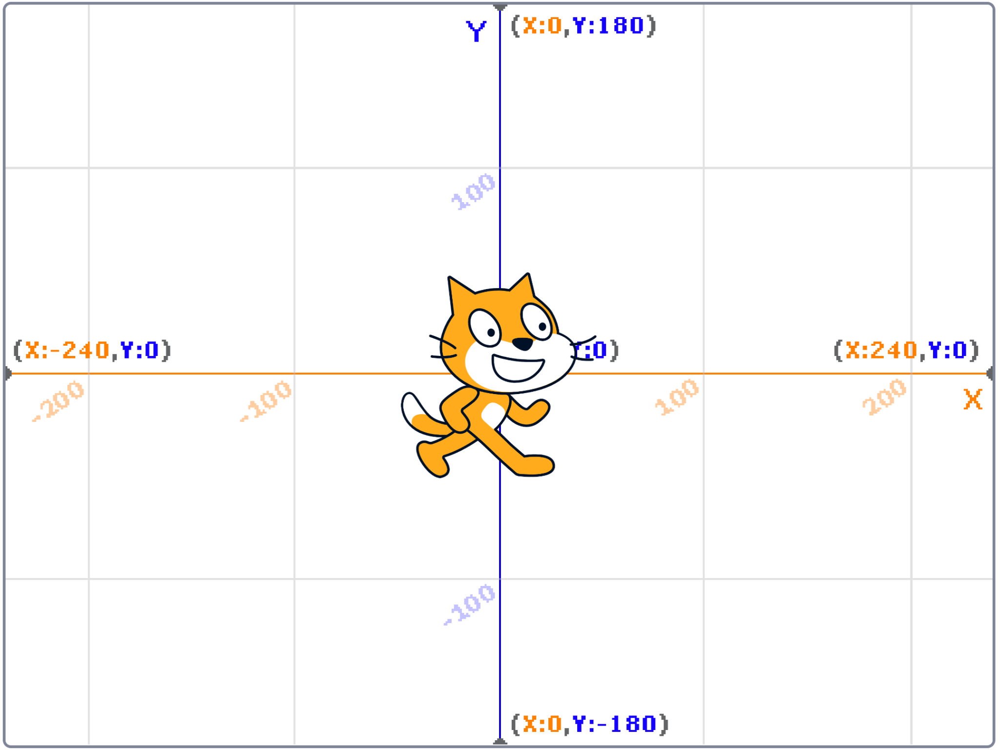

---

# Scratch - Hello World

---

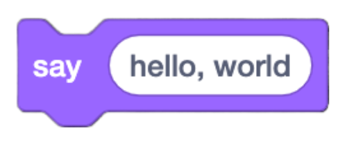

---

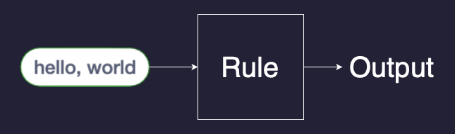

---

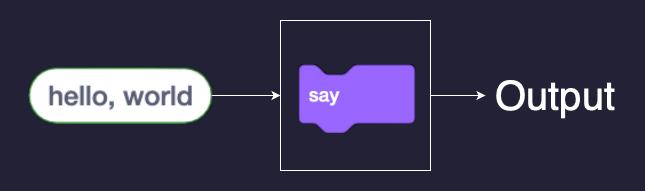

---

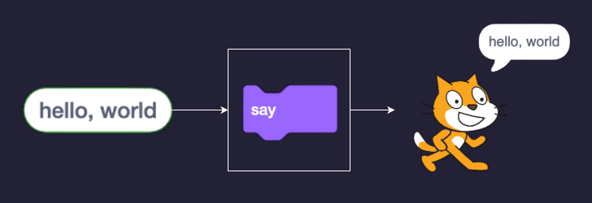

---

# Scratch - what's your name

<!-- 
    1. ask name
    2. join hello and name
    3. say joined hello and name
    4. Demo text to speech -->

---

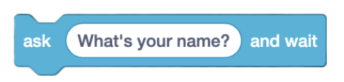

<!-- ask students to figure it out -->

---

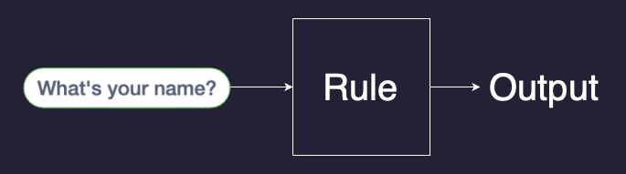

---

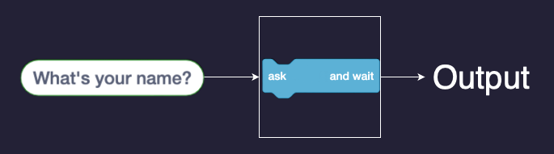

---

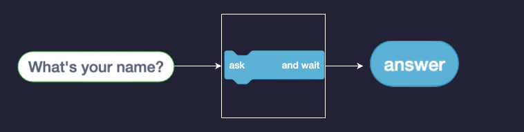

---

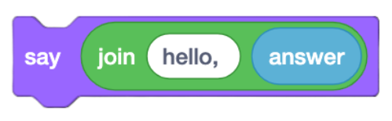

---

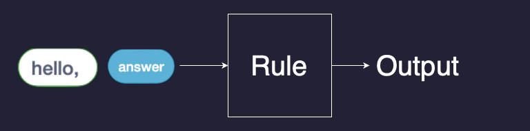

---

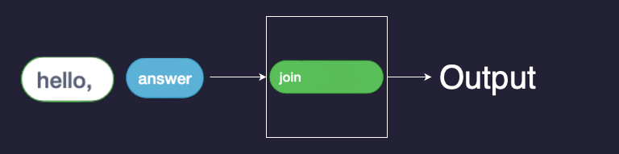

---

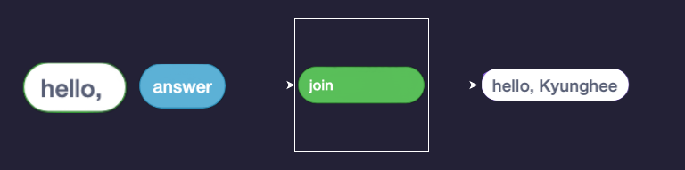

---

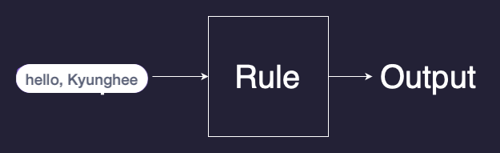

---

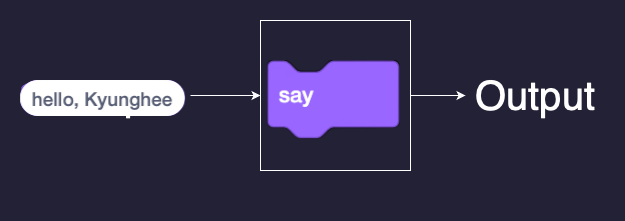

---

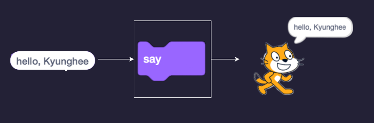

---

# Scratch - Sound

1. Play sound
2. Repeat sound
3. Pause in-between
4. Custom block
5. Function with parameter (n)
6. Conditional (hover mouse over)

---

# Flying cat

---

# Assignment 1

- Create your first program in Scratch
- Requirements:
    - Your project must use at least two sprites
    - Your project must have at least three scripts total (i.e., not necessarily three per sprite).
    - Your project must use at least one conditional, at least one loop, and at least one variable.
    - Your project must use at least one custom block that you have made yourself (via Make a Block), which must take at least one input.
- `File`>`Save to your computer` will download your program (`.sb3`)
- Upload your program to the myCourses course page.
- Due next week
